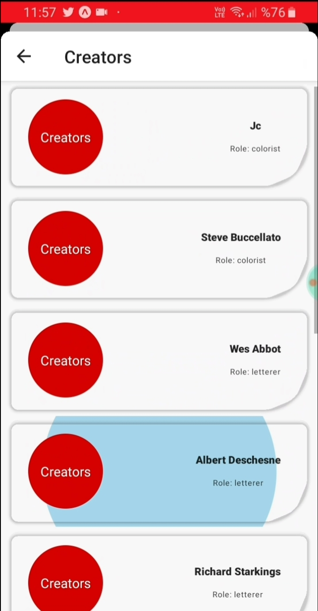

# react-native-marvel-api-demo

**react-native-marvel-api-demo** is my first experience about *Cross-Platform Mobile App Development* using **React Native** that coded via ***TypeScript***.

Context API has used for state management and theme.

Data have been fetched from [Marvel API](https://developer.marvel.com/).

## Requirements

**You must create a Marvel Developer Account** [**here**](https://www.marvel.com/register).

After you do this, you may read the **Authentication doc for generating API Key and Hash** [**here**](https://developer.marvel.com/documentation/authorization)

Then, in project's code, you should ***search*** for **"YOURAPIKEY"** and **"YOURHASH"** keywords and replace all with yours, otherwise project will be down or will not run as expected.

## Installation of Some Important Dependencies

[Expo](https://github.com/expo/react-native/releases/tag/sdk-38.0.2), [react-native-paper](https://github.com/callstack/react-native-paper/releases/tag/v4.0.1), [@react-navigation/native](https://github.com/react-navigation/react-navigation/releases/tag/%40react-navigation%2Fnative%405.7.3), [@react-navigation/stack](https://github.com/react-navigation/react-navigation/releases/tag/%40react-navigation%2Fstack%405.9.0), [@react-navigation/material-bottom-tabs](https://github.com/react-navigation/react-navigation/releases/tag/%40react-navigation%2Fmaterial-bottom-tabs%405.2.16), [@react-navigation/drawer](https://github.com/react-navigation/react-navigation/releases/tag/%40react-navigation%2Fdrawer%405.9.0), [@react-navigation/bottom-tabs](https://github.com/react-navigation/react-navigation/releases/tag/%40react-navigation%2Fbottom-tabs%405.9.0) and [axios](https://github.com/axios/axios/releases/tag/v0.19.2) have been used to develop this demo.

Before, I installed globally some packages.

```bash
npm install -g @react-native-community/cli
npm install -g expo-cli
```

Creation of Project:


## Running

Install all dependecies:

```PowerShell
yarn
```

Run project via Expo on LAN:

```PowerShell
yarn start
```

Or run project via Expo on Tunnel:

```PowerShell
yarn start --tunnel
```

## Some Screens

 <hr>

  <hr>

  <hr>

   <hr>

 <hr>

  <hr>
 
   <hr>

 <hr>

 

## License

[MIT](https://choosealicense.com/licenses/mit/)
